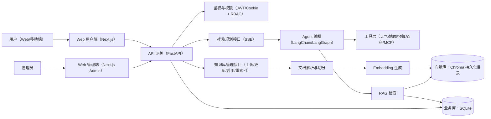
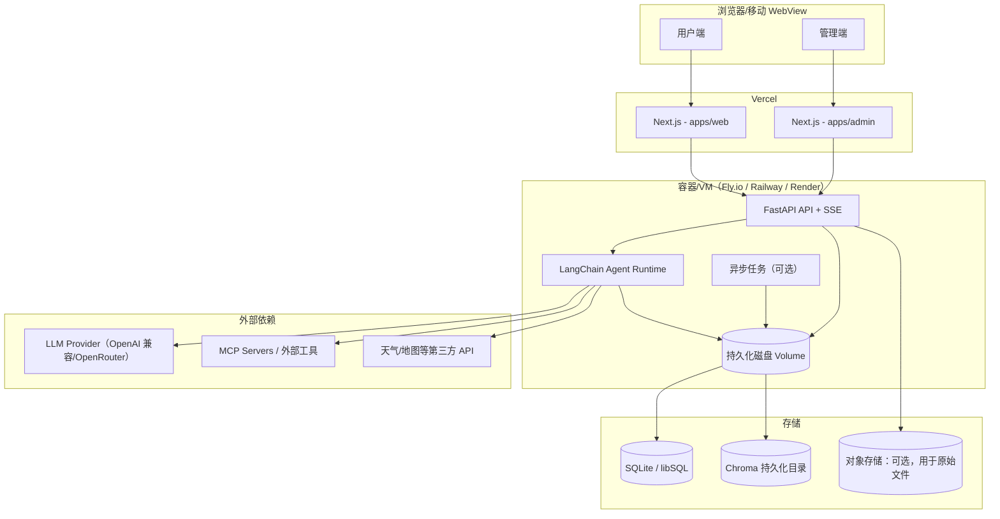

# Travel Agent 全栈技术选型

## 1. 选型目标

技术选型需要满足 4 个前提：

- 适合 AI 应用，支持流式输出、工具调用、结构化结果。
- 适合 Web 产品，支持快速迭代和良好 UI 体验。
- 适合中小团队，复杂度可控。
- 兼顾未来扩展，不在早期引入过重基础设施。

## 2. 总体推荐

结论：前端采用 Next.js（用户端 + 管理后台，monorepo），后端采用 FastAPI + LangChain Python，业务数据库优先 SQLite（可平滑升级到 Postgres），向量检索优先 Chroma（轻量可本地落盘），部署采用“Vercel 前端 + 独立 Python 服务（带持久化磁盘）”。

## 3. 前端技术选型

### 3.1 推荐方案

- 框架：Next.js 15（用户端 + 管理后台）
- 语言：TypeScript
- UI：Tailwind CSS + shadcn/ui
- 状态管理：Zustand
- 数据请求：TanStack Query
- 表单：React Hook Form + Zod
- 图表：Recharts
- 地图：Mapbox GL JS 或高德地图 JS SDK
- 动画：Framer Motion

### 3.2 为什么推荐 Next.js

- 部署到 Vercel 成本低、链路顺。
- 支持 App Router、服务端渲染、SEO 和分段加载。
- 适合做 Landing、控制台、用户中心、分享页。
- 与 AI 生成 UI 代码生态兼容较好，v0 产出的代码也更容易接入。

### 3.3 为什么不用纯 Vue

不是不能用，而是当前目标是尽快做出一个适合 AI 产品和 Vercel 的 Web 项目。

Vue 也可行，但如果从“快速搭产品 + Vercel 部署 + AI 代码辅助”角度看，Next.js 生态更顺手。

如果你更偏 Vue，也可以选 Nuxt 3，但建议在早期只选一个主战场，不要同时维护两套前端。

### 3.4 monorepo（pnpm + workspace）拆分用户端与管理后台

新增管理后台后，推荐把前端拆成 monorepo，以便：

- 用户端与管理后台独立发布、独立路由与权限边界。
- UI 组件、设计 token、类型定义、API client 复用，减少重复代码。
- 统一 lint/format/test，降低多人协作成本。

推荐目录结构：

```text
travel-agent/
  apps/
    web/        # 用户端：对话/行程/分享页
    admin/      # 管理端：知识库/RAG/运营配置
  packages/
    ui/         # 共享 UI 组件（shadcn/ui 二次封装、主题 token）
    shared/     # 共享类型、schema（Zod）、API client、工具函数
    config/     # eslint / tsconfig / tailwind 共享配置
```

推荐包管理：

- pnpm + workspace
- 共享包通过 `@travel-agent/ui`、`@travel-agent/shared` 的方式引用

部署建议：

- 早期可以两个 Next.js 应用都部署到 Vercel
- 后续如果希望同域名不同子路径，也可以做 `web` 为主应用，`admin` 独立域名或子域名（如 `admin.xxx.com`）

## 4. 后端技术选型

### 4.1 推荐方案

- API 框架：FastAPI
- Agent 编排：LangChain Python
- 模型接入：OpenAI 兼容接口封装
- 流式响应：SSE
- 异步任务：Celery 或 Dramatiq，早期也可先用 FastAPI BackgroundTasks
- 配置管理：Pydantic Settings
- 鉴权：JWT + HttpOnly Cookie 或 Bearer Token

### 4.2 为什么推荐 FastAPI

- 与 LangChain Python 结合自然。
- 支持异步、流式、类型校验、OpenAPI 文档。
- 适合快速封装对外 API。
- 团队学习和维护成本低。

### 4.3 推荐的服务划分

- `web`：Next.js 前端。
- `api`：FastAPI，对外暴露统一接口。
- `agent-service`：负责 Agent 规划、工具调用、Prompt 编排。
- `rag-service`：负责知识库检索和索引。

在 MVP 阶段也可以先把 `api` 和 `agent-service` 合并。

## 5. Agent 架构选型

### 5.1 当前建议

早期继续使用 LangChain Python，没有问题。

理由：

- 你已有代码基础。
- MCP 接入链路已经验证过。
- 适合先把产品做出来。

### 5.2 后续建议

如果后面要做复杂流程，建议升级为显式状态编排，而不是只靠单一 Agent。

推荐方向：

- 短期：LangChain + 结构化输出。
- 中期：LangGraph 做多步骤编排。
- 长期：Planner / Search / Budget / Rewrite 分代理。

## 6. MCP 与工具层设计

不要把所有工具直接写死在 `agent.py`。

建议设计统一工具注册层：

- 天气工具。
- 知识库工具。
- 百科工具。
- 地图工具。
- 住宿工具。
- 交通工具。
- 预算工具。

建议接口形式统一：

- 输入统一用结构化 schema。
- 输出统一转为结构化结果。
- 记录耗时、错误率、调用来源。

## 7. 数据层选型

### 7.1 关系型数据库

推荐 SQLite（优先），并保留平滑升级到 PostgreSQL 的路径。

存储内容：

- 用户。
- 会话。
- 行程计划。
- 收藏与分享。
- 工具调用记录。
- Prompt 版本。

SQLite 适用性说明（轻量项目的边界）：

- 适合：单机/单实例、低到中等并发、快速迭代、成本敏感的 MVP。
- 需要注意：多实例并发写入、跨地域高并发、需要复杂权限/审计时，SQLite 会逐渐成为瓶颈。

推荐实现方式：

- ORM：SQLAlchemy 2.x（或 SQLModel）
- 迁移：Alembic
- 部署：FastAPI 服务使用持久化磁盘（volume）保存 `app.db`

可选增强（仍保持 SQLite 轻量心智）：

- Turso / libSQL（SQLite 的远程化），减少自建数据库负担，同时保留 SQLite 体验。

### 7.2 向量检索

在“尽可能轻量”的前提下，优先推荐 Chroma（本地落盘、Python 生态成熟），并保留升级到独立向量数据库的能力。

推荐优先级：

- 方案 A（优先）：Chroma（本地落盘，和 LangChain 结合简单）
- 方案 B：Qdrant（独立服务，适合数据量增长或多实例部署）

选择依据：

- 早期知识库数据量不大时，Chroma 的“本地目录 + 持久化”最省心。
- 如果后面要做多实例、共享向量库或召回压力明显增加，再切换到 Qdrant 更合适。

说明：你了解过 Chroma，这条路径学习成本最低，也最符合“轻量项目”目标。

### 7.3 缓存

MVP 阶段不强制引入 Redis，优先采用“可选缓存”策略。

用途：

- 会话短期状态缓存。
- 热门目的地结果缓存。
- 限流。
- 异步任务状态。

推荐策略：

- 单实例：进程内 TTL cache + SQLite（或文件）即可
- 多实例：再引入 Redis（Upstash/自建）用于共享缓存与限流

## 8. 前后端接口设计建议

建议核心接口如下：

- `POST /api/v1/plans`
- `POST /api/v1/plans/{id}/revise`
- `GET /api/v1/plans/{id}`
- `GET /api/v1/plans`
- `POST /api/v1/chat/stream`
- `POST /api/v1/feedback`

### 8.1 返回结构建议

不要只返回大段文本，建议返回：

- `summary`
- `days`
- `budget`
- `weather`
- `tips`
- `sources`
- `raw_text`

这样前端可同时支持结构化渲染与文本导出。

## 9. 流式输出方案

推荐用 SSE，不建议首版就上 WebSocket。

原因：

- 旅游规划本质上是单向输出为主。
- SSE 与 FastAPI、浏览器兼容简单。
- 更适合展示阶段状态和增量文本。

流式事件建议包含：

- `status`
- `tool_call`
- `tool_result`
- `partial_answer`
- `final_result`
- `error`

## 10. 前端 UI 技术实现建议

### 10.1 组件库

推荐 `shadcn/ui`，原因：

- 可控，不是黑盒。
- 配合 Tailwind 开发效率高。
- AI 生成代码对它支持较好。

### 10.2 样式体系

推荐：

- Tailwind CSS 做原子样式。
- CSS Variables 管理主题。
- 设计 token 单独抽到共享包。

## 11. Vercel 部署策略

### 11.1 推荐部署架构

- Vercel：Next.js（用户端 web + 管理端 admin，可两个项目或子域名拆分）。
- Render / Railway / Fly.io / ECS：FastAPI + Agent 服务（需要持久化磁盘）。
- SQLite：随 FastAPI 服务一起部署（持久化 volume）或使用 Turso/libSQL。
- Redis：可选（只有在多实例/限流/异步队列需求明确时再上）。

### 11.2 为什么不把 Python Agent 直接放在 Vercel

- 可能遇到函数超时问题。
- 长链路 MCP / RAG 请求不稳定。
- 调试和观测不如独立服务清晰。

## 12. 监控与观测

早期就应该接入基础观测，不要等出问题再补。

推荐：

- 日志：结构化日志。
- 链路追踪：LangSmith 或 OpenTelemetry。
- 前端监控：Sentry。
- 后端监控：Sentry + Prometheus / Grafana。

关键指标：

- 首 token 时间。
- 完成时间。
- 工具调用成功率。
- MCP 延迟。
- 模型成本。
- 用户满意度反馈。

## 13. 安全与稳定性

需要考虑：

- API Key 不下发前端。
- 工具超时与重试。
- Prompt Injection 防护。
- 第三方返回异常时的降级策略。
- 敏感信息脱敏。
- 用户输入审核与滥用限制。

## 14. 系统设计图与技术架构图

### 14.1 系统设计图（功能视角）



### 14.2 技术架构图（部署视角）



## 14. 推荐的项目目录

```text
travel-agent/
  apps/
    web/
    api/
  packages/
    shared/
    ui/
    prompts/
  services/
    agent/
    rag/
    tools/
  infra/
    docker/
    scripts/
  docs/
```

## 15. 分阶段技术路线

### 阶段 1：最快上线

- 前端：Next.js + Tailwind + shadcn/ui
- 后端：FastAPI + LangChain
- 数据库：PostgreSQL
- 向量：pgvector
- 缓存：Redis
- 部署：Vercel + Render

### 阶段 2：进入稳定迭代

- Agent 升级为 LangGraph。
- 增加地图、交通、酒店工具。
- 建立 Prompt 版本管理和观测体系。

### 阶段 3：面向商用

- 多环境部署与灰度发布。
- 更细粒度权限系统。
- 运营后台。
- 质量评估和 AB 实验。

## 16. 最终推荐结论

如果你的目标是在较短时间内把这个 Demo 独立成真正可上线的旅游助手，建议采用以下组合：

- 前端：Next.js + TypeScript + Tailwind + shadcn/ui + Zustand + TanStack Query
- 后端：FastAPI + LangChain Python + SSE
- 数据层：PostgreSQL + pgvector + Redis
- 部署：Vercel 部署前端，独立容器平台部署 Python 服务
- 演进方向：先单 Agent，后 LangGraph；先 3 个工具，后逐步扩成地图、POI、酒店、交通、预算体系
